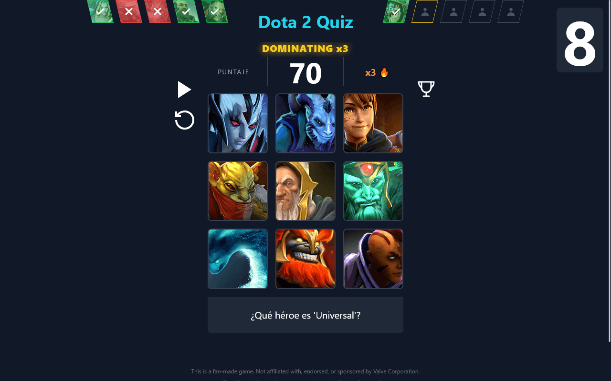
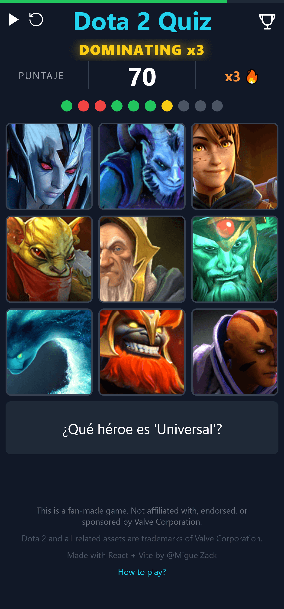

# 🎯 Dota 2 Hero Quiz

A fan-made quiz game to test your Dota 2 hero knowledge. Guess the hero based on questions, build streaks, and beat your high score.

### 🔥 Play Live Demo
[Dota2 Quiz](https://dota2-quiz.vercel.app/)

## 📸 Screenshots

### Vista principal


### Vista Mobile


## ✨ Features

- 10 Rounds per game - Configurable via .env VITE_TOTAL_ROUNDS
- Streak system with Dota announcer sounds: Killing Spree, Dominating, Mega Kill, Unstoppable
- Time bonus system - 10s per round configurable via VITE_TIME_ROUND
- Haptic feedback - Vibration on mobile for hits and misses
- Hero animations with Framer Motion - Shake on wrong answers, scale on correct
- Global leaderboard powered by Supabase - Top 10 with country flags
- LocalStorage cache - Heroes saved to avoid API calls
- Responsive design - Works on desktop and mobile
- Sound effects - Optional correct/wrong + streak voice lines
- Pause/Resume - Timer control during gameplay
- How to Play modal - Shows on first visit using localStorage

## 🛠️ Tech Stack

| Technology | Description |
| --- | --- |
| React 18 + Vite | Fast dev server, HMR, optimized builds |
| TypeScript | Type safety for hero data and game state |
| Tailwind CSS | Utility-first styling |
| Framer Motion | Smooth animations: stagger, shake, scale |
| Supabase | Global ranking database with country detection via ipapi.co |
| Custom Hooks | useGame centralizes all game logic with useState/useRef |

## 🚀 Getting Started

### Prerequisites
- Node.js 18+ and npm or yarn
- Supabase project with a `ranking` table

### Supabase Setup
Create a table called `ranking` with these columns:  
id - uuid, primary key, default: gen_random_uuid()  
name - text  
points - int4  
country - text  
created_at - timestamptz, default: now()  

Enable RLS and add policy: Allow public inserts and selects.

### Environment Variables
```
Create `.env` file:
VITE_TIME_ROUND=10
VITE_TOTAL_ROUNDS=10
VITE_SUPABASE_URL=your_supabase_url
VITE_SUPABASE_ANON_KEY=your_supabase_anon_key
```
### Installation

1. Clone the repo
git clone https://github.com/MiguelZac101/dota2-quiz

2. Install dependencies
cd dota2-quiz
npm install

3. Run dev server
npm run dev

Open http://localhost:5173 and start playing.

### Build for production

npm run build  
npm run preview  

## 📂 Project Structure
```
src/
├── components/      HeroCard, ScoreBoard, Modals, RoundTracker, Ranking
├── hooks/           useGame.ts - all game logic, useSound.ts
├── data/            questions.ts - Question filters and text
├── services/        heroes.ts - getHeroes API call
├── utils/           random.ts - getRandomElements helper
├── types/           hero.ts, question.ts
├── supabase.ts      Supabase client config
└── App.tsx          Main layout + modals
```

## 🎮 How to Play

1. Read the question at the bottom
2. Click the hero that matches the filter
3. Build streaks for multipliers: x2, x3, x4...
4. Answer before timer ends or lose the round
5. Complete 10 rounds and enter your name to save score

## ⚖️ Legal Disclaimer

This is an unofficial fan-made project created for educational and portfolio purposes.  

Not affiliated with, endorsed, or sponsored by Valve Corporation.  

Dota 2, all hero images, names, and sound assets are trademarks and copyrights of Valve Corporation. All rights reserved.  

No profit is made from this project. If you are a Valve representative and have any concerns, please contact me to take it down.  

## 🗺️ Roadmap

- Hard mode: Only hero silhouettes
- Multiplayer: 1v1 real-time
- More question types: Items, abilities
- Stats page: Accuracy %, fastest answer
- Filters: Play by hero role or attribute

## 🤝 Contributing

PRs welcome. For major changes, open an issue first to discuss.

1. Fork the project
2. Create your feature branch git checkout -b feature/AmazingFeature
3. Commit git commit -m 'Add some AmazingFeature'
4. Push git push origin feature/AmazingFeature
5. Open a Pull Request

## 📝 License

MIT License - see LICENSE file.  

Note: This license covers the code only. Dota 2 assets belong to Valve Corporation.

## 🙏 Acknowledgments

Valve for creating Dota 2  
Dota 2 Wiki for hero data  
Supabase for free tier backend  
Framer Motion for amazing animations  
ipapi.co for country detection  

---

## 👨‍💻 Autor

**Miguel Zack**
- GitHub: [@MiguelZac101](https://github.com/MiguelZac101)

If you like this project, give it a ⭐